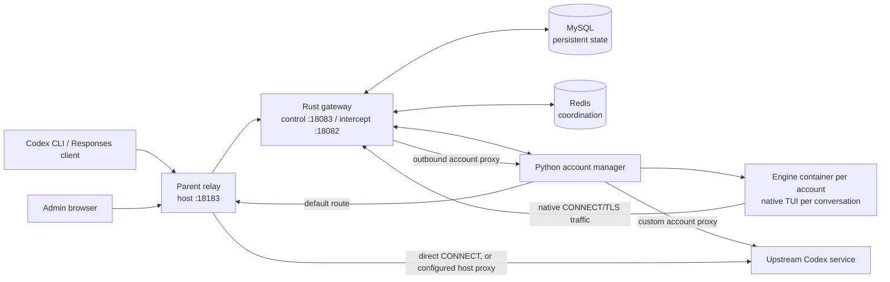

# Codex Engine

**English** · [简体中文](README.zh-CN.md)

Codex Engine is a self-hosted gateway for Codex Responses traffic. It runs official Codex engines under separately managed OAuth accounts, assigns a native TUI to each registered main conversation, and routes client requests through a Rust gateway. This repository contains deployment files; the complete runtime is distributed as Linux arm64 container images. Rust source is private, while Python runtime files are included in the images.

The current public image pair contains Codex **0.155.1**. The [v0.2.2 Release](https://github.com/1198722360/codex-engine/releases/tag/v0.2.2) contains the complete runtime image archive; v0.1.0 contains only a standalone gateway binary.

## Architecture



The five long-running Compose services are the gateway, account manager, parent relay, MySQL, and Redis. One-shot services initialize credentials, the private CA, and the engine image. The account manager creates an additional Engine container and private volumes for each account; those containers are not static Compose services.

For a model request, the gateway checks the client API key, binds the request to a conversation, and selects an eligible account. The native Engine sends its own request through the interception endpoint. The gateway starts from that native request, applies client fields that affect the response, maps supported identifiers and account-bound state, then forwards it through the selected proxy. Responses and observed telemetry return through the gateway. HTTP/WS event recording is an optional admin setting; recorded content is redacted or omitted where required. Changing only a client's Base URL does not provide every client-side tool execution fact to the server.

## Requirements

- Docker with Compose on Linux arm64 or Apple Silicon with Docker Desktop. Other architectures have not been verified for this package.
- The default outbound route is direct through a restricted HTTP CONNECT relay. It permits `chatgpt.com:443`, `ab.chatgpt.com:443`, and `auth.openai.com:443`. A host proxy is optional: set `PARENT_PROXY_PORT` in `.env` to a proxy port reachable by containers through `host.docker.internal`, and set `ACCOUNT_DEFAULT_PROXY_SCHEME` to `http` or `socks5h` to match that proxy. Leave the port empty or unset for direct egress; in that mode the scheme must be `http`. A host proxy listening only on loopback may not accept container connections. Individual accounts may use their own proxy in the web UI.
- Docker socket access: initialization inspects the Engine image, and the account manager creates isolated Engine containers. Protect the host and Docker daemon.

Port **18183** is published on all host interfaces over plain HTTP. Use a trusted network or add TLS/reverse-proxy and access controls before exposing it more broadly.

## Install and start

```sh
git clone https://github.com/1198722360/codex-engine.git
cd codex-engine
# .env only sets GATEWAY_HOST_PORT; the default route needs no host proxy.
./deploy.sh
docker compose ps
curl -fsS http://127.0.0.1:18183/health
```

`deploy.sh` only runs `docker compose pull` and `docker compose up -d --remove-orphans`. The first start creates random management/API credentials, a private CA, database credentials, and named volumes. It also registers a disabled **Initial account**; it does not authorize that account automatically.

The web UI is at `http://127.0.0.1:18183/` on the deployment host. For another device, replace `127.0.0.1` with the host's reachable address. Change `GATEWAY_HOST_PORT` in `.env` if 18183 is occupied.

## Sign in and authorize an account

Read the separate management password and client API key **on the deployment host**:

```sh
docker compose run --rm --no-deps --entrypoint cat gateway /run/bootstrap/management-token
docker compose run --rm --no-deps --entrypoint cat gateway /run/bootstrap/api-token
```

Enter the **management token** in the web UI. In **账号管理** (Accounts), authorize the disabled Initial account with the Device Code flow, then enable it for scheduling. To add another account, use **新增独立账号** (New independent account), choose its proxy, complete its Device Code login, and enable it. The client API key is not an upstream OAuth credential.

## Connect a Codex client

Use the **client API key** for Codex API-key login. When the CLI runs on the deployment host, pass the key through standard input rather than a command-line argument:

```sh
gateway_api_key="$(docker compose run --rm --no-deps --entrypoint cat gateway /run/bootstrap/api-token)"
printf '%s' "$gateway_api_key" | codex login --with-api-key
unset gateway_api_key
```

For a CLI on another machine, transfer the client API key securely and pass it to `codex login --with-api-key` through standard input there. This replaces that CLI's saved login; keep the management token separate.

In the web UI's **主对话会话** (Main conversations) page, create one entry for each main conversation. Copy its Base URL or the generated launch command. Keep Codex's default OpenAI provider and change only `openai_base_url` for that run:

```sh
codex -c 'openai_base_url="http://127.0.0.1:18183/session/<root>/v1"'
codex -c 'openai_base_url="http://127.0.0.1:18183/session/<root>/v1"' resume
```

Replace `<root>` with the value shown on the page and use the host's reachable address for a remote client. Reuse the entry when resuming that conversation. Create a new entry and CLI for another main conversation; do not use `/new` in an existing entry. The gateway also exposes `/v1` for supported HTTP Responses clients, but that shared endpoint does not provide the explicit one-main-conversation entry described above.

## Operations and release tags

Compose pulls [`ghcr.io/1198722360/codex-engine-gateway:latest`](https://github.com/users/1198722360/packages/container/package/codex-engine-gateway) and [`ghcr.io/1198722360/codex-engine-engine:latest`](https://github.com/users/1198722360/packages/container/package/codex-engine-engine) directly from GitHub Container Registry. Releases also receive a shared UTC timestamp tag for each image; `.env` contains no image references and the supplied Compose file always selects `:latest`. MySQL and Redis use ordinary version tags without digest suffixes. The Compose project name is defined in `docker-compose.yml` and needs no `.env` setting.

Use `docker compose ps` and `docker compose logs --tail=100 gateway account-manager` to inspect runtime status. `docker compose down` stops Compose services while retaining their volumes. **Do not use `down -v` as a routine stop command**: credentials, conversation state, and the database live in volumes, and the account manager creates additional per-account volumes outside the static Compose list. Back up the database and project/account volumes before maintenance.

Re-running `./deploy.sh` retains volumes but pulls the current `:latest` images. MySQL and Redis version tags are maintained upstream and may change on a later pull. Even under the same `:latest` tag, a changed Engine image identity is rejected by the saved release manifest; a normal `deploy.sh` rerun is therefore not an upgrade path. An Engine update needs the controlled drain and migration flow before replacement.

Anonymous GHCR pulls and a fresh install from the public repository passed Compose startup, service health, and the web endpoint. A separate isolated install passed repeated deployment and TLS verification through the default direct route. Fresh OAuth authorization, live model calls, and running cross-version upgrades remain unverified. Server-side telemetry follows verified source facts; events without enough evidence may remain local instead of being delivered upstream.

## Distribution terms

You may download and run the unmodified Codex Engine release images and binary for your own use. This grant does not include permission to modify or redistribute Codex Engine components. Bundled third-party software remains under their own licenses.
