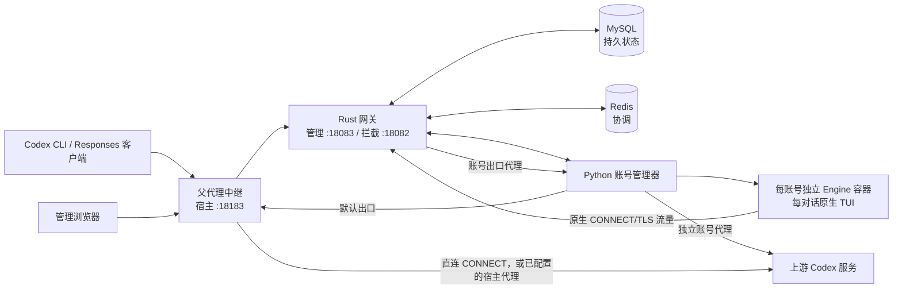

# Codex Engine

[English](README.md) · **简体中文**

Codex Engine 是自托管的 Codex Responses 网关。它为分别管理的 OAuth 账号运行官方 Codex 引擎，为每个已登记的主对话分配原生 TUI，并通过 Rust 网关处理客户端请求。本仓库提供部署文件；完整运行程序以容器镜像发布。Rust 源码存放在私有仓库，运行所需的 Python 文件包含在镜像中。

当前公开镜像包含 Codex **0.155.1**。[v0.2.2 Release](https://github.com/1198722360/codex-engine/releases/tag/v0.2.2) 提供完整运行镜像归档；更早的 v0.1.0 仅提供独立网关二进制。

## 架构



Compose 常驻五项服务：网关、账号管理器、父代理中继、MySQL、Redis。`deploy.sh` 先拉取 Engine 镜像，再由一个临时 `init` 服务在 Gateway 镜像内生成凭据、私有 CA 并核对引擎发布清单。持久化数据直接保存在 `docker-compose.yml` 同目录下的 `gateway-state/`、`manager-state/`、`engine-bootstrap/`、`mysql-secrets/`、`redis-secrets/`、`private-ca/`、`public-ca/`、`mysql-data/`、`redis-data/`、`gateway-capture/`、`gateway-resources/` 和 `account-volumes/`。账号管理器为每个账号创建由 `account-volumes/` 提供存储的 Engine 容器；这些容器不在 Compose 静态服务列表中。

模型请求进入网关后，先验证客户端 API Key、绑定已登记对话并选择符合条件的账号。原生 Engine 的请求经拦截入口发出；网关以该原生请求为基础，替换影响响应的客户端业务字段，处理受支持的 ID 与账号归属状态，再通过选定代理转发。响应及已观测的遥测经网关返回。HTTP/WS 录制是管理界面的选配功能；录制内容按规则脱敏或省略。客户端仅修改 Base URL，不会把全部本地工具执行事实传给服务端。

## 运行前提

- 在 Linux amd64/arm64 宿主机或运行 Docker Desktop 的 Apple Silicon 电脑上安装 Docker 和 Compose 插件。Compose 不再固定单一架构；发布标签须同时含有 `linux/amd64` 与 `linux/arm64`，部署前可用 `docker buildx imagetools inspect ghcr.io/1198722360/codex-engine-engine:latest` 检查。私有源码仓库使用 `scripts/publish-runtime-images.sh` 发布两种架构；发布前须先用具备 `write:packages` 权限的 GitHub Token 执行 `docker login ghcr.io`。服务端部署前还要确认两个 GHCR 包都设为 **Public**；包仍为私有时，即使 Compose 写法正确，拉取也会返回 `unauthorized`。
- 默认出口经受限的 HTTP CONNECT 中继直连，仅允许 `chatgpt.com:443`、`ab.chatgpt.com:443` 和 `auth.openai.com:443`。宿主代理不是必需项：若要使用，在 `.env` 中把 `PARENT_PROXY_PORT` 设为容器经 `host.docker.internal` 能访问的代理端口，并按代理类型设置 `ACCOUNT_DEFAULT_PROXY_SCHEME=http` 或 `socks5h`。端口留空或不设置时走直连，此时协议须为 `http`。仅监听宿主机回环地址的代理未必接受容器连接。管理界面也支持为单个账号设置独立代理。
- 部署环境须允许访问 Docker socket：初始化服务要读取引擎镜像身份，账号管理器要创建独立 Engine 容器。请保护宿主机和 Docker 守护进程的访问权限。

默认 **18183** 端口以明文 HTTP 监听宿主机所有网卡。向更大范围开放前，应在受信任网络中使用，或自行配置 TLS／反向代理和访问控制。

## 安装和启动

```sh
git clone https://github.com/1198722360/codex-engine.git
cd codex-engine
# 启动前修改 .env 中的 WEB_PASSWORD 和 CLIENT_API_KEY。
./deploy.sh
docker compose ps
curl -fsS http://127.0.0.1:18183/health
```

仓库跟踪的 `.env` 含有 `WEB_PASSWORD=123456` 和 `CLIENT_API_KEY=123456`。这两项是公开、所有下载者共用的示例凭据；在允许其他设备访问前，请先改掉。`WEB_PASSWORD` 用于网页和管理 API（`Authorization: Bearer <WEB_PASSWORD>`），`CLIENT_API_KEY` 用于客户端业务请求；两者都不是上游 OAuth 凭据。默认出口不需要宿主代理。

`deploy.sh` 会先切换到部署文件所在目录，并按 Compose 标签清理旧版遗留的 `engine-image` 一次性容器，再运行 `docker compose pull`。首次部署没有发布清单时，它会拉取 `ghcr.io/1198722360/codex-engine-engine:latest`；已有环境则读取 `manager-state/releases/` 中登记的平台镜像 config digest，若本机仍有该镜像就把 `latest` 标签恢复到它，避免把可变标签直接带入旧环境，最后运行 `docker compose up -d --remove-orphans`。若登记的旧镜像已被清理，脚本会在启动前以中英文提示停止，要求先恢复该镜像或执行受控升级。这一步不删除本地数据目录和常驻服务。一次性 `init` 服务在 Gateway 镜像内完成身份、CA 和引擎清单检查。请保持随仓库提供的 `start-redis.sh` 与 `docker-compose.yml` 位于同一目录；Compose 会以只读方式把它挂载到 Redis 容器，用于密码校验和配置生成。首次启动会保存 `.env` 中的两项接入凭据，并创建上述本地目录。它还会登记一个停用状态的 **Initial account**，不会自动完成账号授权。日后轮换任一接入凭据时，修改 `.env` 后重新运行 `./deploy.sh`；随后用新网页密码登录，并更新使用旧 API Key 的客户端。

在部署宿主机访问 `http://127.0.0.1:18183/`。从其他设备访问时，把 `127.0.0.1` 换成宿主机实际地址。若 18183 已被占用，先修改 `.env` 的 `GATEWAY_HOST_PORT`。

## 登录管理界面与授权账号

在网页输入 `.env` 中的 `WEB_PASSWORD`。进入“账号管理”，对停用的 Initial account 执行 Device Code 授权，确认原生登录完成后开启调度。若要加入第二个账号，选择“新增独立账号”，配置出口代理、完成该账号的 Device Code 登录，再启用调度。网页授权发生在账号独立原生环境中。

## 接入 Codex 客户端

Codex 的 API Key 登录使用 `.env` 中的 `CLIENT_API_KEY`。若 CLI 与服务部署在同一台宿主机，通过标准输入传给 Codex，避免把密钥放进命令参数：

```sh
(. ./.env; printf '%s' "$CLIENT_API_KEY" | codex login --with-api-key)
```

若 CLI 在另一台电脑上，先以安全方式传递客户端 API Key，再通过该电脑的标准输入执行 `codex login --with-api-key`。此操作会替换该 CLI 当前保存的登录；网页密码不要用于业务请求。

在网页“主对话会话”页面，为每个主对话创建一个入口，并复制页面给出的 Base URL 或启动命令。保留 Codex 默认 OpenAI provider，只为本次运行修改 `openai_base_url`：

```sh
codex -c 'openai_base_url="http://127.0.0.1:18183/session/<root>/v1"'
codex -c 'openai_base_url="http://127.0.0.1:18183/session/<root>/v1"' resume
```

把 `<root>` 换成页面提供的值；远程客户端需换成宿主机实际地址。恢复同一对话时沿用原入口。另开主对话时，新建入口并启动新的 CLI；不要在原入口执行 `/new` 后继续发送。网关也提供 `/v1` 供受支持的 HTTP Responses 客户端使用，但该公共入口不具备上述显式的“一主对话一入口”归属。

## 运维与镜像标签

Compose 直接从 GitHub Container Registry 拉取 [`ghcr.io/1198722360/codex-engine-gateway:latest`](https://github.com/users/1198722360/packages/container/package/codex-engine-gateway) 和 [`ghcr.io/1198722360/codex-engine-engine:latest`](https://github.com/users/1198722360/packages/container/package/codex-engine-engine)。每次发布还为两张镜像生成相同 UTC 时间戳标签；`.env` 包含公开的默认接入凭据和宿主端口，不包含镜像引用，仓库提供的 Compose 文件始终使用 `:latest`。MySQL、Redis 使用不带摘要后缀的普通版本标签。Compose 项目名已写在 `docker-compose.yml` 中，无需在 `.env` 配置。

使用 `docker compose ps` 和 `docker compose logs --tail=100 gateway account-manager` 查看状态。`docker compose down` 会停止 Compose 服务并保留数据卷。**不要把 `down -v` 当作日常停止命令**：凭据、对话状态和数据库都在卷中，账号管理器还会创建不在 Compose 静态列表中的账号卷。维护前须备份数据库及项目、账号相关数据卷。

再次执行 `./deploy.sh` 会保留目录和常驻服务，并更新 Gateway、管理器等 Compose 镜像。已有发布清单时，脚本会锁住已登记的 Engine config digest；普通重部署不会拉入新的 Engine，也不会改写清单。若旧 Engine 镜像不在本机，脚本会在 `init` 启动前停止并提示恢复镜像或执行受控升级。Engine 更新须完成请求排空、状态迁移、替换和提交，不能把 `latest` 重新拉取当成升级流程。MySQL、Redis 的版本标签由上游维护，下次拉取时内容也会变化。

此前一套公开仓库新克隆环境完成过匿名拉取和新装，Compose 启动、服务健康与网页入口均通过；当前包可见性和服务器架构仍须在目标主机再次核对。另一隔离新装完成重复部署和默认直连路由的 TLS 校验。全新账号 OAuth 授权、真实模型请求、运行中跨版本升级仍未验收。服务端遥测依照已确认的来源事实处理；证据不足的事件会留在本地，不冒充上游已交付。

## 分发条款

允许下载和运行未经修改的 Codex Engine 发布镜像及二进制。此许可不包含修改或再分发 Codex Engine 组件的权利；随包提供的第三方软件适用各自许可。
