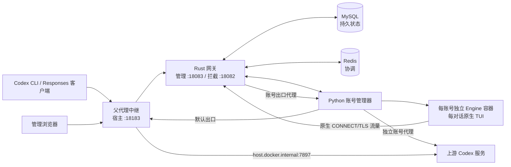

# Codex Engine

[English](README.md) · **简体中文**

Codex Engine 是自托管的 Codex Responses 网关。它为分别管理的 OAuth 账号运行官方 Codex 引擎，为每个已登记的主对话分配原生 TUI，并通过 Rust 网关处理客户端请求。本仓库提供部署文件；完整运行程序以 Linux arm64 容器镜像发布。Rust 源码存放在私有仓库，运行所需的 Python 文件包含在镜像中。

当前公开镜像包含 Codex **0.155.1**。[v0.2.2 Release](https://github.com/1198722360/codex-engine/releases/tag/v0.2.2) 提供完整运行镜像归档；更早的 v0.1.0 仅提供独立网关二进制。

## 架构



Compose 常驻五项服务：网关、账号管理器、父代理中继、MySQL、Redis。一次性服务负责生成凭据、私有 CA 并准备引擎镜像。账号管理器另外为每个账号创建 Engine 容器及私有数据卷；这些容器不在 Compose 静态服务列表中。

模型请求进入网关后，先验证客户端 API Key、绑定已登记对话并选择符合条件的账号。原生 Engine 的请求经拦截入口发出；网关以该原生请求为基础，替换影响响应的客户端业务字段，处理受支持的 ID 与账号归属状态，再通过选定代理转发。响应及已观测的遥测经网关返回。HTTP/WS 录制是管理界面的选配功能；录制内容按规则脱敏或省略。客户端仅修改 Base URL，不会把全部本地工具执行事实传给服务端。

## 运行前提

- 在 Linux arm64 宿主机或运行 Docker Desktop 的 Apple Silicon 电脑上安装 Docker 和 Compose 插件。本包只验证了 Linux arm64 镜像；其他架构尚未验收。
- 宿主机上游代理须从容器通过 `host.docker.internal:7897` 访问。按实际代理端口修改 `.env` 的 `PARENT_PROXY_PORT`，并将 `ACCOUNT_DEFAULT_PROXY_SCHEME` 设为匹配的 `http` 或 `socks5h`。仅监听宿主机回环地址的代理未必接受容器连接。管理界面也支持为单个账号设置独立代理。
- 部署环境须允许访问 Docker socket：初始化服务要读取引擎镜像身份，账号管理器要创建独立 Engine 容器。请保护宿主机和 Docker 守护进程的访问权限。

默认 **18183** 端口以明文 HTTP 监听宿主机所有网卡。向更大范围开放前，应在受信任网络中使用，或自行配置 TLS／反向代理和访问控制。

## 安装和启动

```sh
git clone https://github.com/1198722360/codex-engine.git
cd codex-engine
# 先检查 .env，尤其是 PARENT_PROXY_PORT 和 GATEWAY_HOST_PORT。
./deploy.sh
docker compose ps
curl -fsS http://127.0.0.1:18183/health
```

`deploy.sh` 只运行约定的 `docker compose pull` 和 `docker compose up -d --remove-orphans`。首次启动会在 Docker 命名卷生成随机管理令牌、业务 API Key、私有 CA 和数据库凭据。它还会登记一个停用状态的 **Initial account**，不会自动完成账号授权。

在部署宿主机访问 `http://127.0.0.1:18183/`。从其他设备访问时，把 `127.0.0.1` 换成宿主机实际地址。若 18183 已被占用，先修改 `.env` 的 `GATEWAY_HOST_PORT`。

## 登录管理界面与授权账号

在**部署宿主机**分别读取管理密码和客户端 API Key：

```sh
docker compose run --rm --no-deps --entrypoint cat gateway /run/bootstrap/management-token
docker compose run --rm --no-deps --entrypoint cat gateway /run/bootstrap/api-token
```

在网页输入**管理令牌**。进入“账号管理”，对停用的 Initial account 执行 Device Code 授权，确认原生登录完成后开启调度。若要加入第二个账号，选择“新增独立账号”，配置出口代理、完成该账号的 Device Code 登录，再启用调度。网页授权发生在账号独立原生环境中；客户端 API Key 不是上游 OAuth 凭据。

## 接入 Codex 客户端

Codex 的 API Key 登录使用**客户端 API Key**。若 CLI 与服务部署在同一台宿主机，通过标准输入传给 Codex，避免把密钥放进命令参数：

```sh
gateway_api_key="$(docker compose run --rm --no-deps --entrypoint cat gateway /run/bootstrap/api-token)"
printf '%s' "$gateway_api_key" | codex login --with-api-key
unset gateway_api_key
```

若 CLI 在另一台电脑上，先以安全方式传递客户端 API Key，再通过该电脑的标准输入执行 `codex login --with-api-key`。此操作会替换该 CLI 当前保存的登录；管理令牌不要用于业务请求。

在网页“主对话会话”页面，为每个主对话创建一个入口，并复制页面给出的 Base URL 或启动命令。保留 Codex 默认 OpenAI provider，只为本次运行修改 `openai_base_url`：

```sh
codex -c 'openai_base_url="http://127.0.0.1:18183/session/<root>/v1"'
codex -c 'openai_base_url="http://127.0.0.1:18183/session/<root>/v1"' resume
```

把 `<root>` 换成页面提供的值；远程客户端需换成宿主机实际地址。恢复同一对话时沿用原入口。另开主对话时，新建入口并启动新的 CLI；不要在原入口执行 `/new` 后继续发送。网关也提供 `/v1` 供受支持的 HTTP Responses 客户端使用，但该公共入口不具备上述显式的“一主对话一入口”归属。

## 运维与镜像标签

公开 Docker Hub 仓库分别为 [`wxyin/codex-engine-gateway`](https://hub.docker.com/r/wxyin/codex-engine-gateway) 与 [`wxyin/codex-engine-engine`](https://hub.docker.com/r/wxyin/codex-engine-engine)。每张镜像发布 `latest` 与相同 UTC 时间戳标签。仓库提供的 `.env` 选定一对相同时间戳标签；Compose 缺省值为 `latest`。MySQL、Redis 使用不带摘要后缀的普通版本标签。

使用 `docker compose ps` 和 `docker compose logs --tail=100 gateway account-manager` 查看状态。`docker compose down` 会停止 Compose 服务并保留数据卷。**不要把 `down -v` 当作日常停止命令**：凭据、对话状态和数据库都在卷中，账号管理器还会创建不在 Compose 静态列表中的账号卷。维护前须备份数据库及项目、账号相关数据卷。

再次执行 `./deploy.sh` 会保留卷，并沿用 `.env` 选定的网关／引擎时间戳对。MySQL、Redis 的版本标签由上游维护，下次拉取时内容可能变化。修改引擎镜像标签不等于原地升级：初始化程序会核对实际镜像身份，并拒绝未经审查的替换。运行中换版须另行执行请求排空与状态迁移流程。

本包的新装检查覆盖匿名镜像拉取、Compose 启动、服务健康与网页入口；尚未覆盖全新账号 OAuth 授权、真实模型请求或运行中跨版本升级。服务端遥测依照已确认的来源事实处理；证据不足的事件会留在本地，不冒充上游已交付。

## 分发条款

允许下载和运行未经修改的 Codex Engine 发布镜像及二进制。此许可不包含修改或再分发 Codex Engine 组件的权利；随包提供的第三方软件适用各自许可。
